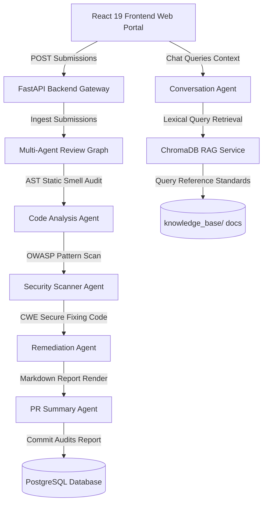

# AI Code Review & Security Analysis Agent

A production-ready full-stack containerized platform for static application security testing (SAST), code quality auditing, and interactive code review remediation.

---

## 🌟 System Features

### 🔍 Static Application Security Scanner (SAST)
- Scans Python and Java codebases to detect OWASP Top 10 vulnerabilities (SQL Injection, XSS, CSRF, secrets leaks, command escapes, weak hashing, ssrf).
- Extracts confidence scores, vulnerable highlighted line snippets, CWE references, and OWASP tag identifiers.

### 🧹 Advanced Code Quality Auditing
- Lexes codebases to measure nesting depths, magic literal numbers, long/complex methods, and Solid principles violations.
- Implements custom fallback workflow orchestrators running cleanly in offline developer workspaces.

### 💡 Conversational Code Review Assistant (RAG Grounded)
- Evaluates code queries grounding responses inside secure coding standards (OWASP guidelines, CERT parameters, Clean Code rules).
- Retains session-based conversation context for dynamic developer follow-up discussions.
- Stores references in local vector collection indexes using ChromaDB.

---

## 🏗️ System Architecture



---

## 🌐 REST API Gateway Mapping

| HTTP Verb | REST Path Endpoint | Access Role | Description |
| --- | --- | --- | --- |
| `POST` | `/api/v1/auth/register` | Public | Registers a new developer/admin account |
| `POST` | `/api/v1/auth/login` | Public | Auths user, issues JWT access/refresh token sets |
| `POST` | `/api/v1/auth/refresh` | Developer | Rotates and reissue authentication keys |
| `POST` | `/api/v1/submissions/upload` | Developer | Uploads a compressed Java/Python archive folder |
| `POST` | `/api/v1/submissions/paste-code` | Developer | Submits raw code snippet pastes for scans |
| `GET` | `/api/v1/projects` | Developer | Fetches paginated, sorted project lists |
| `GET` | `/api/v1/reports/project/{project_id}` | Developer | Fetches code audits historical runs |
| `GET` | `/api/v1/reports/project/{project_id}/findings`| Developer | Aggregates all code issues inside a project |
| `GET` | `/api/v1/reports/{report_id}` | Developer | Fetches detailed findings and code snippets |
| `POST` | `/api/v1/reports/{report_id}/export` | Developer | Downloads CSV, JSON, MD, or PDF exports |
| `POST` | `/api/v1/reports/{report_id}/chat` | Developer | Submits RAG chat queries to Code Assistant |

---

## 🐳 Getting Started with Docker Compose (Recommended)

Start the entire stack including database instances, FastAPI servers, Nginx gateways, and React client dashboards in one step:

1. Clone or access the project folder:
   ```bash
   cd ai-code-review-security-agent
   ```
2. Initialize environment configurations:
   ```bash
   cp .env.example .env
   ```
3. Run container orchestrations:
   ```bash
   npm run docker:up
   ```
4. Access portals:
   - **Client Dashboard**: `http://localhost:3000`
   - **REST Swagger Docs**: `http://localhost:8000/docs`
   - **PostgreSQL**: `localhost:5432`

---

## 💻 Running Locally

### 1. Backend Server Setup
```bash
# Initialize and activate Python virtual environment
python -m venv .venv
source .venv/bin/activate # Windows: .venv\Scripts\activate

# Install requirements
pip install -r requirements.txt

# Run FastAPI gateway dev server (port 8000)
uvicorn backend.app.main:app --reload
```

### 2. Frontend Client Setup
```bash
# Install workspace scripting rules
npm install

# Build Vite client dev server (port 3000)
npm run frontend:dev
```

### 🧪 Executing Verification Tests
```bash
python -m pytest tests/
```
