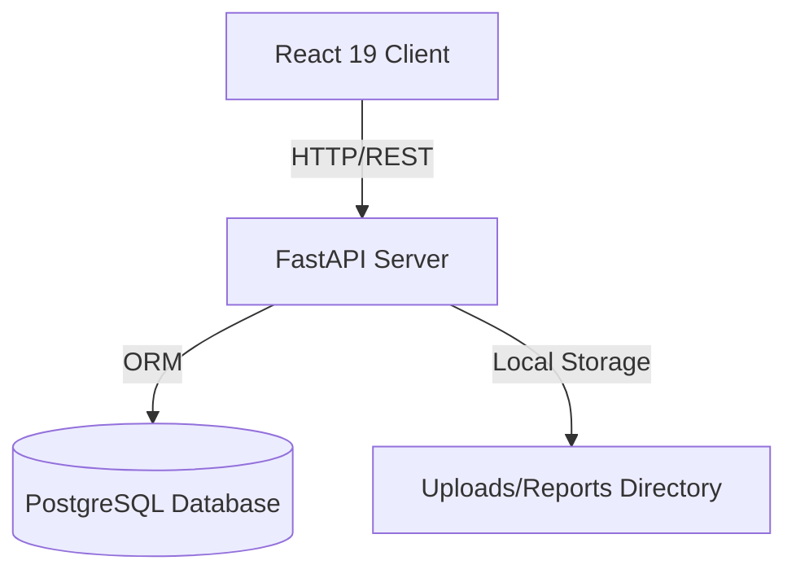

# Architecture Documentation

## Architecture Design System

The application represents a full-stack, modular architecture separated into an API engine (FastAPI) and a client interface (React 19).



### Backend Architecture
The backend is structured around a Clean Architecture / Service-Repository pattern:
- **Models**: Defines database schemas mapped via SQLAlchemy.
- **Schemas**: Validates input-output payloads using Pydantic.
- **Services**: Encapsulates business logic (analyzers, user registration, token generators).
- **API Endpoints**: Maps HTTP routes and invokes dependencies.
- **Middleware**: Intercepts requests for authentication (JWT Verification) and CORS controls.

### Frontend Architecture
The frontend is constructed using a unidirectional data flow design:
- **API Client**: Axios instance handling authorization token headers.
- **Contexts**: Providers managing global state (Theme preferences, authentication sessions, and project selections).
- **Protected Routing**: React Router v6 guards enforcing access restrictions.
- **Component UI Toolkit**: Pure Tailwind custom wrappers mimicking shadcn styles.

---

## Database Schema Design

```mermaid
erDiagram
    users ||--o{ projects : owns
    users ||--o{ code_submissions : submits
    projects ||--o{ code_submissions : groups
    code_submissions ||--o{ analysis_reports : evaluates
    analysis_reports ||--o{ review_findings : details
    analysis_reports ||--o{ report_exports : creates

    users {
        string id PK
        string email UNIQUE
        string hashed_password
        boolean is_active
        string role
        datetime created_at
    }
    projects {
        string id PK
        string name
        string description
        string user_id FK
        datetime created_at
    }
    code_submissions {
        string id PK
        string project_id FK
        string user_id FK
        string submission_type
        string file_path
        string raw_code
        string status
        datetime created_at
    }
    analysis_reports {
        string id PK
        string submission_id FK
        string summary
        integer score
        datetime created_at
    }
    review_findings {
        string id PK
        string report_id FK
        string file_path
        integer line_number
        string severity
        string category
        string title
        string description
        string recommendation
        string code_snippet
    }
    report_exports {
        string id PK
        string report_id FK
        string export_type
        string file_path
        datetime created_at
    }
```
